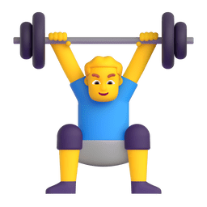
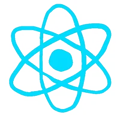
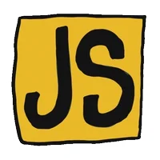

[;梁上尘+祝您今天愉快!&center=true&size=27)](https://git.io/typing-svg)

<picture>
  <source media="(prefers-color-scheme: dark)" srcset="./assets/images/coding.gif" />
  <source media="(prefers-color-scheme: light)" srcset="./assets/images/developer.svg" height="225px" />
  
</picture>

&nbsp;

  &emsp;
  &emsp;

# 🙋 你好

<table>
<tr><td>

### 🤺 关于我

&emsp;&emsp;你好，我是梁上尘（Liang Shangchen），一个实战派的全栈/后端开发者。

&emsp;&emsp;目前主要聚焦于高并发系统重构、容器化架构以及基于大模型的自动化工作流构建。

&emsp;&emsp;喜欢在 Linux (Ubuntu) 环境下用命令行解决问题，追求代码的极致结构与执行效率。

&emsp;&emsp;<strong>我们正在让这个世界变得更加美好，通过代码的重复使用和延展构建完美体系。</strong>

</td></tr>

<tr><td>

### 🎯 近期关注

- 🔧 **大型工具链重构**：推进核心业务代码的架构重构计划
- 🤖 **Agent 框架工程化**：探索 Skill 与 MCP 在实际开发场景中的落地
- 📱 **移动端分发与部署**：打通 iOS/Android 端应用的完整打包与自动化上架工作流

</td></tr>
</table>

  <picture>
    <source media="(prefers-color-scheme: dark)" srcset="https://readme-jokes.vercel.app/api?hideBorder&bgColor=%23121212" />
    <source media="(prefers-color-scheme: light)" srcset="https://readme-jokes.vercel.app/api?hideBorder&bgColor=%ffffff" />
    
  </picture>

<picture>
  <source media="(prefers-color-scheme: dark)" srcset="https://github-readme-streak-stats.herokuapp.com/?user=liangshangchen&theme=highcontrast&hide_border=true" />
  <source media="(prefers-color-scheme: light)" srcset="https://github-readme-streak-stats.herokuapp.com/?user=liangshangchen&theme=default&hide_border=true" />
  
</picture>

<picture>
  <source media="(prefers-color-scheme: dark)" srcset="https://github-readme-activity-graph.vercel.app/graph?username=liangshangchen&theme=xcode&bg_color=FF000000&hide_border=true" />
  <source media="(prefers-color-scheme: light)" srcset="https://github-readme-activity-graph.vercel.app/graph?username=liangshangchen&theme=xcode&bg_color=FF000000&color=000000&hide_border=true" />
  
</picture>

 

<table>
  <tr>
    <td></td>
    <td></td>
  </tr>
</table>

 

 

